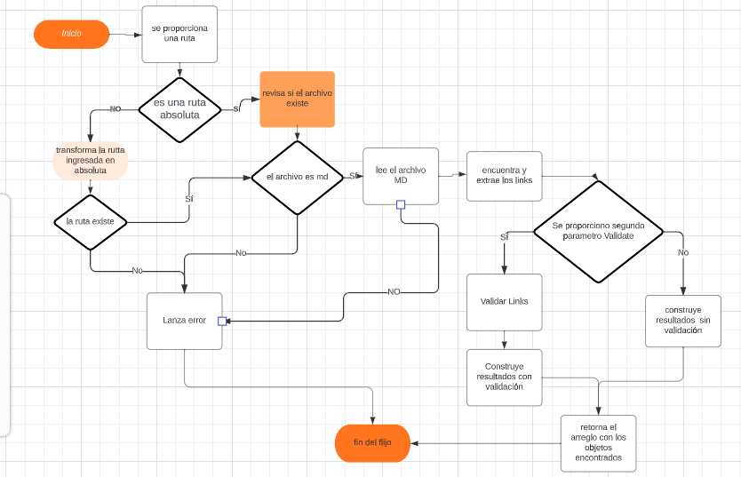
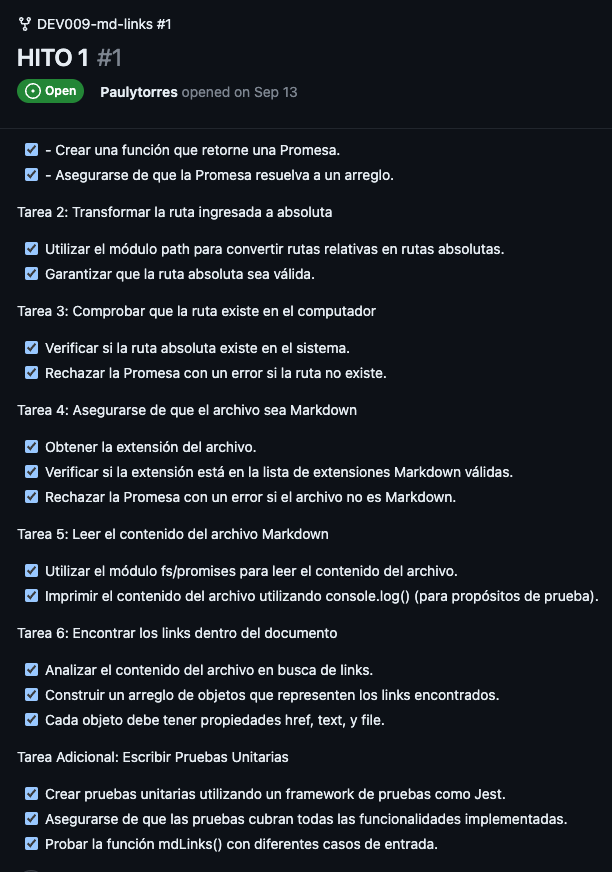
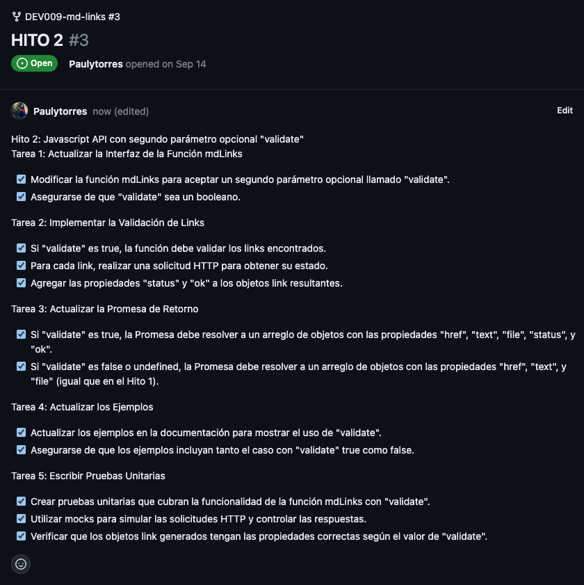
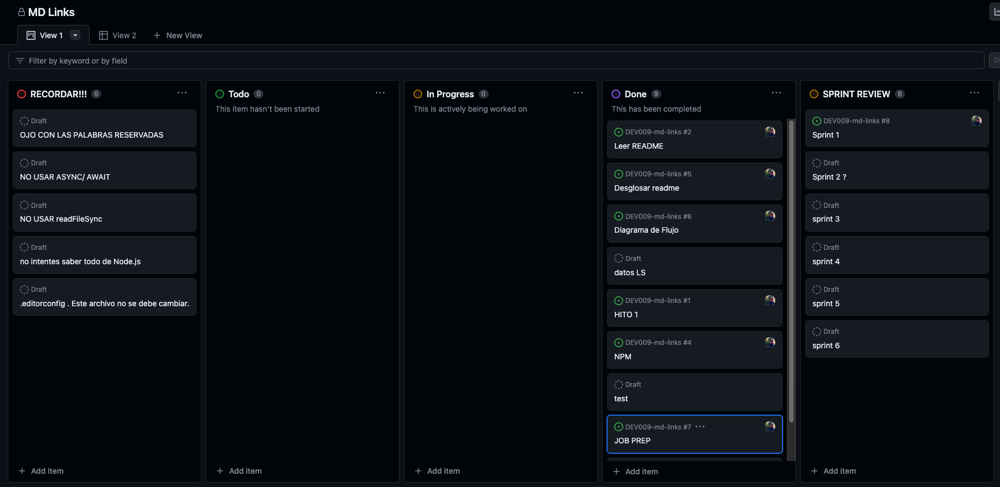

# Markdown Links

## Índice

* [1. Preámbulo](#1-preámbulo)
* [2. Resumen del proyecto](#2-resumen-del-proyecto)
* [3. Consideraciones generales](#3-consideraciones-generales)
* [4. Tecnologias utilizadas](#4-tecnologias-utilizadas)
* [5. Diagrama de Flujo](#5-diagrama-de-flujo)
* [6. Hitos](#6-hitos)
* [7. Detalle de archivos](#7-detalle-de-archivos)
* [8. Planificación del proyecto](#8-planificación-del-proyecto)
* [9. Autor](#9-Autor)

***

## 1. Preámbulo

MD-Links es una herramienta creada con Node.js que te permite analizar archivos en formato Markdown y verificar los enlaces (links) que contienen. Siendo una herramienta ideal para mantener la integridad de los enlaces en los documentos Markdown y reportar estadísticas sobre ellos.

## 2. Resumen del proyecto

En este proyecto busca desarrollar una librería en Node.js que funcionará como herramienta para analizar links dentro de archivos Markdown. 

Markdown es un lenguaje de marcado ligero ampliamente utilizado en la comunidad de desarrolladores y en numerosas plataformas, como GitHub, foros, blogs y más. Los archivos Markdown son ubicuos en los repositorios de proyectos, destacando especialmente el archivo README.md, que actúa como la puerta de entrada a cualquier proyecto de código abierto. Sin embargo, estos archivos a menudo contienen enlaces (links) a recursos externos, como documentación, ejemplos de código, o referencias. La calidad y validez de estos enlaces es esencial para garantizar que la información compartida sea confiable y útil.

En este contexto, nace MD-Links, como una librería en Node.js. MD-Links se posiciona como una solución para abordar el desafío de verificar y validar los enlaces dentro de archivos Markdown. Su utilidad es innegable, ya que permite a los desarrolladores mantener la integridad de sus proyectos, evitando la presencia de enlaces rotos o no válidos que podrían perjudicar la experiencia del usuario y la confianza en la información compartida.

## 3. Consideraciones generales

* Este proyecto se debe "resolver" de manera individual.
* El rango de tiempo estimado para completar el proyecto es de 3 a 5 sprints.
* Consideramos los hitos 1 y 2 como los criterios de aceptación mínimos del proyecto.

## 4. Tecnologias utilizadas

**JavaScript** es un lenguaje de programación ampliamente utilizado en el desarrollo web. Se ejecuta en el navegador del usuario y se utiliza para crear interacciones dinámicas en sitios web, como validación de formularios, animaciones y actualización de contenido en tiempo real.

**Axios** es una biblioteca de JavaScript que se utiliza para realizar solicitudes HTTP desde el navegador o el servidor. Es comúnmente utilizado en aplicaciones web para comunicarse con servidores, recuperar datos y enviar datos a través de solicitudes HTTP.

**FS (File System)** generalmente se refiere al módulo de sistema de archivos en Node.js. Permite interactuar con el sistema de archivos local, lo que significa que puede leer y escribir archivos en el servidor. Se utiliza para tareas como lectura y escritura de archivos, manipulación de directorios y más.

**Jest** es un popular marco de prueba de JavaScript desarrollado por Facebook. Se utiliza para escribir pruebas unitarias y de integración en aplicaciones JavaScript. Jest facilita la escritura y ejecución de pruebas y proporciona herramientas para realizar pruebas automatizadas de manera eficiente.

**Git** es un sistema de control de versiones ampliamente utilizado que permite el seguimiento de cambios en el código fuente. Es esencial para colaborar en proyectos de desarrollo de software, ya que ayuda a controlar revisiones, fusionar cambios y mantener un historial completo de todas las modificaciones en un proyecto.

**GitHub** es una plataforma de desarrollo colaborativo basada en la web que utiliza Git como su sistema de control de versiones subyacente. Permite a los desarrolladores alojar, colaborar y gestionar proyectos de software de manera eficiente. GitHub proporciona características como seguimiento de problemas, gestión de proyectos y colaboración en equipo a través de repositorios en línea.

## 5. Diagrama de Flujo

Con esta herramienta visual podemos comprender de manera más efectiva lo que se debe hacer, facilitando la planificación de tareas y objetivos.

## 6. Hitos

Recuerda que la mejor manera de abordar un problema es descomponiéndolo en
problemas más pequeños. Por esta razón, te recomendamos que completes este
proyecto trabajando por hitos.

* [Hito 1](./docs/01-milestone.md)

* [Hito 2](./docs/02-milestone.md)

## 7. Detalle de archivos

* `README.md` 
* `index.js`: Contiene la función (`mdLinks`).
* `data.js`: Contiene mis funciones puras. 
* `mdLinks.js`: contiene el código que luego se utiliza para tomar información proporcionada a través de la línea de comando y probar la función mdLinks.
* `package.json` Contiene la configuración de nombre, versión, descripción, autores, licencia,
  dependencias, scripts (pretest, test, ...), main, bin
* `.editorconfig` con configuración para editores de texto. Este archivo no se
  debe cambiar.
* `.eslintrc` con configuración para linter. Este archivo contiene una
  configuración básica para ESLint, si deseas agregar reglas adicionales
  como Airbnb deberás modificar este archivo.
* `.gitignore` para ignorar `node_modules` u otras directorios que no deban
  incluirse en control de versiones (`git`).
* `test/md-links.spec.js` contiene los tests unitarios para la `función mdLinks`.
* `test/data.spec.js` contiene los test para las `funciones puras`. 

## 8. Planificación del proyecto

El projecto se planifico utilizando Github Projects 

## 9. Autor
- [Paulina Torres A. _(CL)_](https://github.com/Paulytorres/)